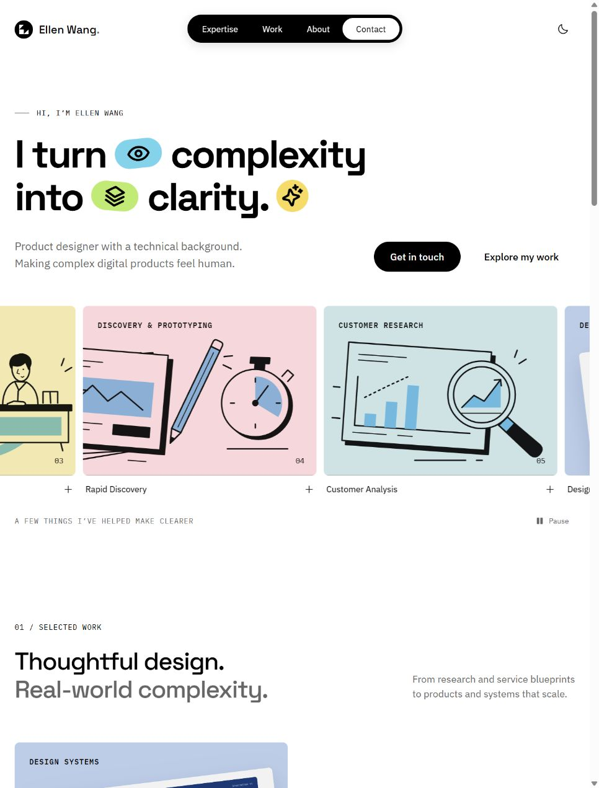

# Ellen Wang portfolio

A responsive React portfolio combining the supplied recording's editorial layout, Ellen Wang's published content, and Modern8-bits foundations.

[Live website](https://ellenwang918.github.io/portfolio-v2/) · [GitHub repository](https://github.com/ellenWang918/portfolio-v2)



## Preview and development

The local preview runs at http://localhost:4173/ when started on port 4173.

```sh
npm install
npm run dev -- --port 4173
npm run build
npm run preview
```

## Features

- Spacious hero with inline accent icons and a floating navigation pill.
- Moving project gallery with pause, hover/focus pause, and reduced-motion support.
- Five complete case studies with direct links, project navigation, keyboard dismissal, focus containment, and browser history support.
- Research, Product, and Systems expertise tabs with keyboard navigation.
- Responsive project grid, About section, email links, copy-email action, and social links.
- Persisted light/dark preference and self-hosted fonts.

## Editing

`src/data/projects.json` contains the original case-study copy and metadata. `src/App.jsx` contains the homepage narrative and page components. `src/tokens.css` maps the design foundations; `src/portfolio.css` contains layout and responsive styling. Original artwork is in `public/assets`, and fonts are in `public/fonts`.

Example case-study URL: `/?project=design-system-palms`.

## Sources and adaptation

- Content and public project illustrations: [ellenwang.space](https://ellenwang.space/), retrieved 8 October 2026.
- Typography, neutral palette, spacing, component foundations, and theme roles: [Modern8-bits design system](https://modern8-bits-up.vercel.app/?path=/docs/foundation-design-token--docs).
- Composition, floating navigation, inline colorful motifs, horizontal gallery, staggered projects, and expertise tabs: supplied `ScreenRecording_10-08-2026 11-02-32_1.mp4`.
- Space Grotesk and IBM Plex font families: Google Fonts, self-hosted locally. Interface icons: Phosphor.

The recording is a layout reference. Homepage copy is adapted to Ellen's product-design practice. Public illustrative project artwork and confidentiality notes are retained. The source site's published dates are preserved.

## Validation

The production build and included hosting-worker tests pass. Browser checks cover desktop, tablet, 390px and 320px phone layouts; all five projects; direct-link reloads; keyboard controls; theme persistence; and contact interactions. See `design-qa.md` for the comparison record and `docs/screenshots` for previews.

## Hosting

This is a static frontend. Email actions open the visitor's email client. A custom backend is not required.

For Vercel, `vercel.json` explicitly selects Vite, runs `npm run build`, and publishes `dist/client`. This overrides an existing Next.js framework preset on the connected project.

The GitHub Pages workflow builds and publishes the site after each push to `main`. It sets `GITHUB_PAGES=true` to use the repository's `/portfolio-v2/` base path. Local previews and other hosting targets use `/` by default.

The existing Sites-compatible worker and build adapter are preserved. `npm run build` creates `dist/client`, `dist/server`, and `dist/.openai/hosting.json`. Run `npm run test:sites` before a Sites handoff. For a conventional static host, publish `dist/client` with a single-page fallback to `index.html`.
